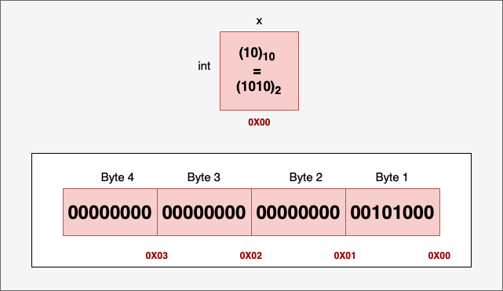
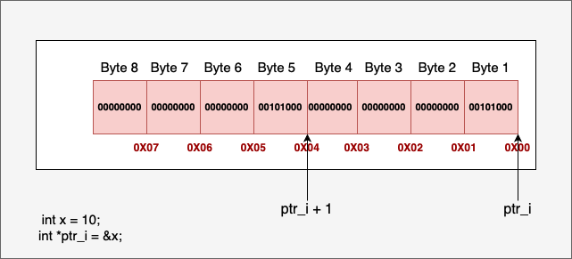
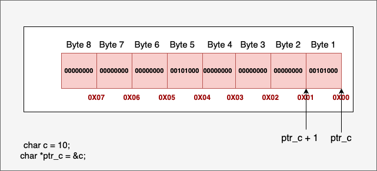
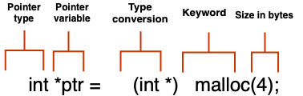
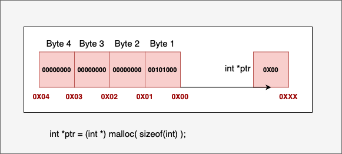

Refresher
=========

Pointers
--------

A pointer is a variable whose value is a memory address.

Let ``x`` be an integer variable defined and initialized to the value 10::

   int x = 10;

An integer takes 4 bytes (32 bits) of memory in a 32-bit or 64-bit system. If we assume the first byte is stored at memory address 0x00, then the last byte will be stored at address 0x03. An integer pointer can store the address of an integer variable::

   int *ptr = &x;

.. note::
   The result of the unary ``&`` operator is a pointer to its operand. The operand shall be an lvalue. -- C++03 standard.

Example of invalid and valid lvalue addresses::

   int i = 5;
   int *p;

   p = &5;  // Error, 5 is not an lvalue
   p = &i;  // OK

As the address of the variable ``x`` starts at 0x00, the pointer variable ``ptr`` will have the value 0x00.

Pointer Arithmetic
------------------

Memory Allocation
-----------------

+---------------+--------------------------------------------------------------------------------+
| Segment       | Description                                                                    |
+===============+================================================================================+
| Text segment  | Compiled program code (executable instructions)                                 |
+---------------+--------------------------------------------------------------------------------+
| Data segment  | Global variables, static variables.                                             |
+---------------+--------------------------------------------------------------------------------+
| Stack         | Stores local variables, function arguments, and return addresses. Memory is     |
|               | managed automatically by the compiler.                                          |
+---------------+--------------------------------------------------------------------------------+
| Heap          | Used for dynamically allocated memory. Managed by the programmer using library  |
|               | functions (e.g., malloc, free in C; new, delete in C++).                       |
+---------------+--------------------------------------------------------------------------------+

If memory allocation is successful, **malloc** returns a void pointer (``void *``) to the beginning of the allocated memory block. This pointer can then be cast to the desired type. If memory allocation fails (e.g., not enough memory available), **malloc** returns a NULL pointer.

.. warning:: Always check the return value of **malloc** to ensure allocation was successful before using the pointer. Remember to free memory allocated with **malloc** when it's no longer needed to prevent memory leaks.

Example of allocating a vector::

   float *b = (float *)malloc(n * sizeof(float));
   /* however, the vector has yet to be initialized. */

Example of allocating a matrix and linking pointers::

   float **A = (float **)malloc(n * sizeof(float *));
   float *A_data = (float *)malloc(n * n * sizeof(float));
   for (int i = 0; i < n; i++) {
       A[i] = A_data + i * n;
   }

The layout of ``A`` and ``A_data``::

   A  --> [ptr_0] ----> A_data --> [val_00] [val_01] ... [val_0(n-1)]  <-- Row 0
          [ptr_1] ----,            [val_10] [val_11] ... [val_1(n-1)]  <-- Row 1
          [ptr_2] ----|-,          [val_20] [val_21] ... [val_2(n-1)]  <-- Row 2
          ...         | `->        ...
          [ptr_n-1] --`----->      [val_(n-1)0] ... [val_(n-1)(n-1)] <-- Row n-1

Command-Line Arguments
----------------------

When a program is executed from the command line, the interpreter (e.g., ``sh``/``bash``) parses the command line and passes information to the ``main`` function as::

   - ``argc`` (argument count): an integer representing the number of command-line arguments.
   - ``argv`` (argument vector): an array of C-style strings (``char *argv[]`` or ``char **argv``), where each string is one of the arguments.

Example::

   ./myprogram arg1 "another arg"

The ``argv`` layout::

   argv:
   +-----------+     +---------------------------------------+
   | argv[0]   |---->| '.', '/', 'm', 'y', ..., '\0'           |  (Program name)
   +-----------+     +---------------------------------------+
   | argv[1]   |---->| 'a', 'r', 'g', '1', '\0'                 |  (First argument)
   +-----------+     +---------------------------------------+
   | argv[2]   |---->| 'a', 'n', 'o', 't', ..., '\0'           |  (Second argument)
   +-----------+     +---------------------------------------+
   | argv[3]   |---->  NULL  (terminating pointer)               |
   +-----------+

To provide utilities based on user input, parse command-line arguments. The ``strcmp`` function from ``<string.h>`` is useful for comparing strings::

   int strcmp(const char *str1, const char *str2);

It returns 0 if both strings match.

Example of argument parsing::

   #include <stdio.h>
   #include <string.h>

   int main(int argc, char *argv[]) {
       if (argc > 1) {
           if (strcmp(argv[1], "--myflag") == 0) {
               printf("myflag was detected!\n");
           } else if (strcmp(argv[1], "--help") == 0) {
               printf("Usage: %s [--myflag] [--help] ...\n", argv[0]);
           } else {
               printf("Unknown argument: %s\n", argv[1]);
           }
       } else {
           printf("No arguments provided.\n");
       }
       return 0;
   }

I/O
---

Common C standard library functions (from ``<stdio.h>``) for file I/O:

.. code-block:: c

   FILE *fopen(const char *filename, const char *mode);

- Opens ``filename`` in ``mode`` (e.g., "r", "w", "a").
- Returns a ``FILE *`` on success or ``NULL`` on error.

Example::

   FILE *fp = fopen("input.txt", "r");
   if (fp == NULL) {
       fprintf(stderr, "Error opening file");
   }

.. code-block:: c

   char *fgets(char *str, int n, FILE *stream);

- Reads a line into ``str`` of size ``n``.
- Stops at newline, EOF, or when n-1 chars read.

Example::

   char buffer[256];
   if (fgets(buffer, 256, fp) != NULL) {
       printf("Read line: %s", buffer);
   }

.. code-block:: c

   int fscanf(FILE *stream, const char *format, ...);

- Reads formatted input from ``stream``.
- Returns the number of items assigned.

Example of reading floats::

   int n = 10;
   float *b = (float *)malloc(n * sizeof(float));
   if (b == NULL) {
       perror("Failed to allocate memory");
   } else {
       for (int i = 0; i < n; i++) {
           if (fscanf(fp, "%f", &b[i]) != 1) {
               fprintf(stderr, "Error reading float at index %d\n", i);
               break;
           }
       }
       free(b);
   }

.. code-block:: c

   int fprintf(FILE *stream, const char *format, ...);

- ``stream``: target file stream.
- ``format``: format string with specifiers.
- Returns number of chars written or negative on error.

Example::

   if (fprintf(out_fp, "%.8f\n", x[k]) < 0) {
       fprintf(stderr, "Error writing element x[%d] to output file.\n", k);
       break;
   }

.. code-block:: c

   int fclose(FILE *stream);

- Closes the stream.
- Returns 0 on success.

Example::

   if (fp != NULL) {
       fclose(fp);
   }

You can see these functions in action in the **read_mat_file** utility::

.. code-block:: bash

   gcc read_mat_file.c -o read_mat_file
   ./read_mat_file trefethen_dense.dat

Exercises
---------

1.  In ``linear-algebra-GJ-filescope.c``, review the ``gauss_jordan_partial`` function and its invocation in ``main``. Add missing validation or error checks (e.g., null pointers, invalid return values) to make the program more resilient.

2.  Throughout ``linear-algebra-GJ-filescope.c``, you’ll find TODO comments for error handling. Replace these placeholders with sensible logic: print informative messages and exit if necessary.

3.  Refactor ``linear-algebra-GJ-filescope.c`` by splitting related functionality into separate source (``.c``) and header (``.h``) files (e.g., matrix operations vs. utilities) for easier maintenance.

4.  In ``linear-algebra-multisolvers.c``, add a new command-line option (e.g., ``--cholesky``) to let users select the Cholesky solver for symmetric matrices. Update ``main`` and argument-parsing logic accordingly.
